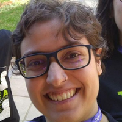
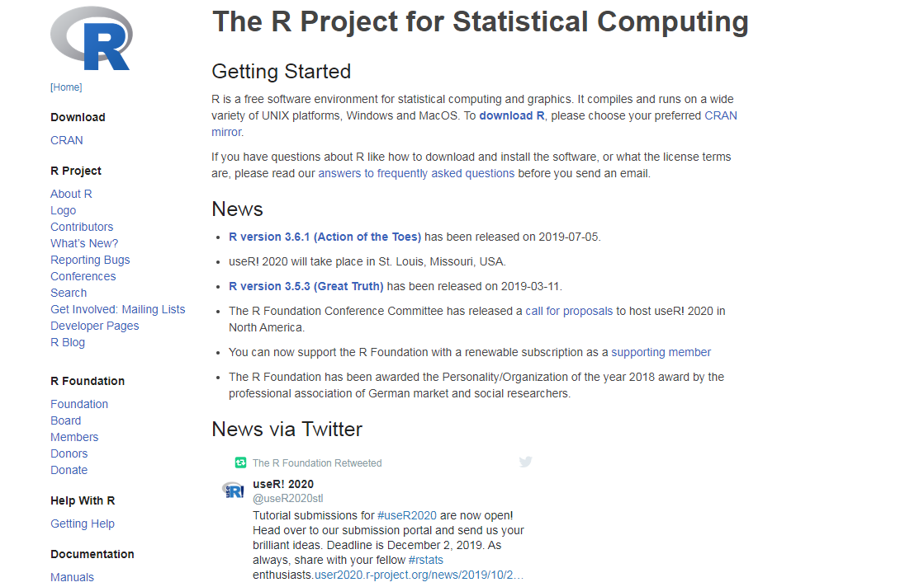
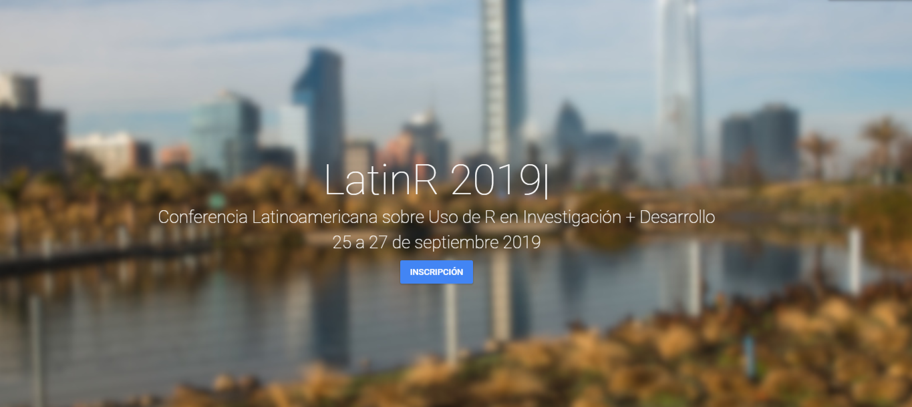
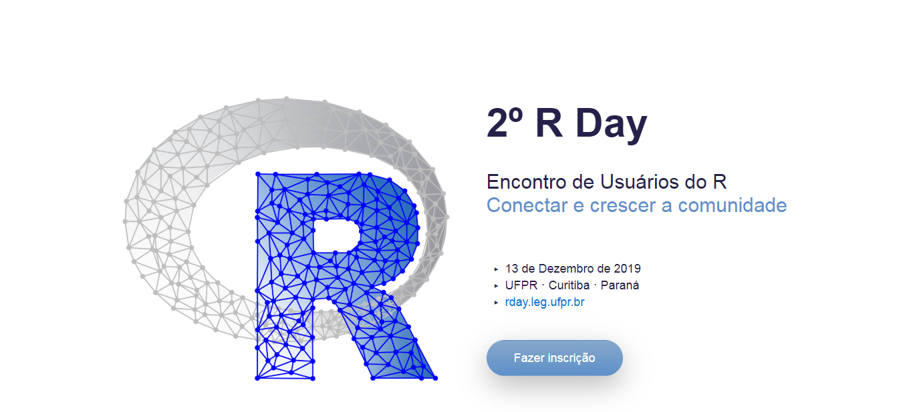
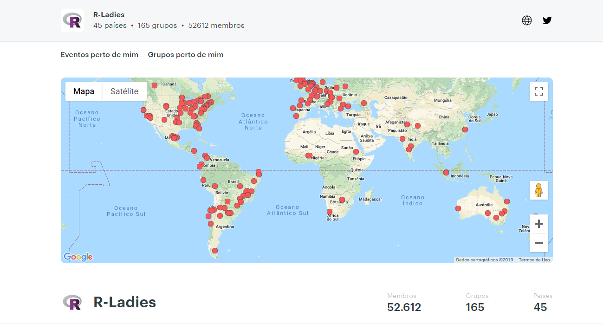
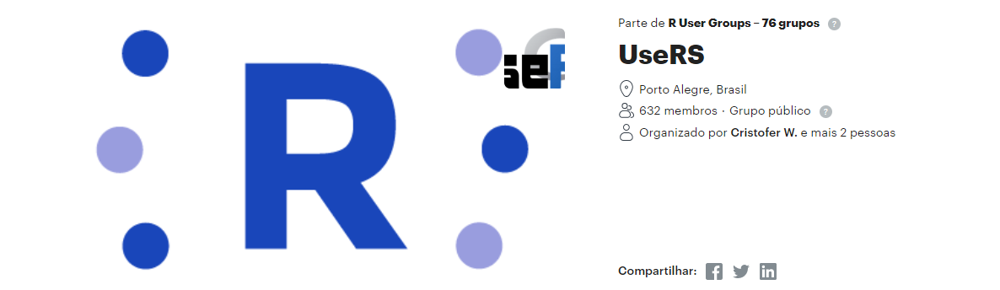
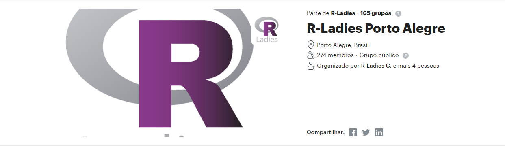

class: center, middle

## Iara Passos

.center[]


Bacharela em Ciências Socias e mestra em Sociologia pela Universidade Federal do Rio Grande do Sul. Pesquisa os usos e impactos de técnicas estatísticas e de IA na segurança pública. Já trabalhou com análise de dados em projetos de pesquisa vinculados ao PNUD, BID, Cemaden e CNJ. Atualmente é líder de pesquisa no Cappra Institute for Data Science onde realiza pesquisas na área de Ciências de Dados e auxilia empresas a adotarem uma cultura Data-Driven, já tendo trabalhado para Banco do Brasil, Unilever, Sebrae, Warner Channel, entre outros. Trabalha com R e Python há mais de 7 anos. Também é graduanda em Estatística pela UFRGS, criadora do R-Ladies Porto Alegre e organizadora do AI Inclusive.

---

# O que é R?

* R é uma linguagem de programação de código aberto feita por estatísticos com uma ampla gama de aplicações  


--
* Fornece um amplo espectro de técnicas gráficas e estatísticas em uma infinidade de pacotes


--

* Também é possível programar métodos próprios para funcionalidades específicas 

--

* Criada no início dos anos 90 pelos estatísticos Robert Gentleman e Ross Ihaka. Posteriormente, foi desenvolvida em um esforço colaborativo em vários locais do mundo. 


---


class: inverse, center, middle

# A importância da comunidade

---

background-image:  url("index_files/figure-html/minions.gif")
background-size: cover
class: center, inverse

---

# Comunidade global

* A comunidade constrói o R


* Fóruns


* Sites e repositórios


* Encontros e meetups

---

class: inverse, center

```{r echo=FALSE, fig.align='center', message=FALSE, warning=FALSE, out.width='120%', paged.print=FALSE}
 
```


# R Foundation

---
class: inverse, center

```{r echo=FALSE, fig.align='center', message=FALSE, warning=FALSE, out.width='120%', paged.print=FALSE}
 
```


# useR!

---
class: inverse, center


```{r echo=FALSE, fig.align='center', message=FALSE, warning=FALSE, out.width='120%', paged.print=FALSE}
 
```

# LatinR
---

class: inverse, center

```{r echo=FALSE, fig.align='center', message=FALSE, warning=FALSE, out.width='120%', paged.print=FALSE}
 
```

# RDay
---

class: inverse, center

```{r echo=FALSE, fig.align='center', message=FALSE, warning=FALSE, out.width='120%', paged.print=FALSE}
 
```

# R-Ladies

---
class: inverse, center 
.center[]

.center[]

# Comunidade Porto Alegre

---

# Markdown

* Linguagem de marcação - não tem capacidade de processamento e de execução de funções 

--
* Possibilidade de utilização de uma linguagem comum para a criação de vários tipos de documento 

--
* Criada em 2004 por John Gruber e com colaboração do Aaron Swartz

--
* Converte para diversos formatos: pdf, doc, html, powerpoint, etc. 


---

# RMarkdown

* Integração do Markdown com R e outras linguagens de programação 

--
* Knitr possibilita executar pedaços de códigos dentro de um arquivo markdown 

--
* Pandoc converte o arquivo markdown para o formato desejado


---

class: inverse, center

```{r echo=FALSE, fig.align='center', message=FALSE, warning=FALSE, out.width='60%', paged.print=FALSE}
 knitr::include_graphics('index_files/figure-html/catcomputer.gif')
```

---

# Algumas considerações antes de começarmos


* Turma grande

* Dúvidas pontuais

* Pessoal da organização auxiliando

* Contato posterior

* Material será disponibilizado

---


```{r echo=FALSE, fig.align='center', message=FALSE, warning=FALSE, out.width='65%', paged.print=FALSE}
 
```

---


# Bora?


```{r echo=FALSE, fig.align='center', message=FALSE, warning=FALSE, out.width='80%', paged.print=FALSE}
 
```


---

class: inverse, center

```{r echo=FALSE, fig.align='center', message=FALSE, warning=FALSE, out.width='80%', paged.print=FALSE}
 knitr::include_graphics('index_files/figure-html/ahwg.gif')
```

### Slides created via the R package [**xaringan**](https://github.com/yihui/xaringan).
